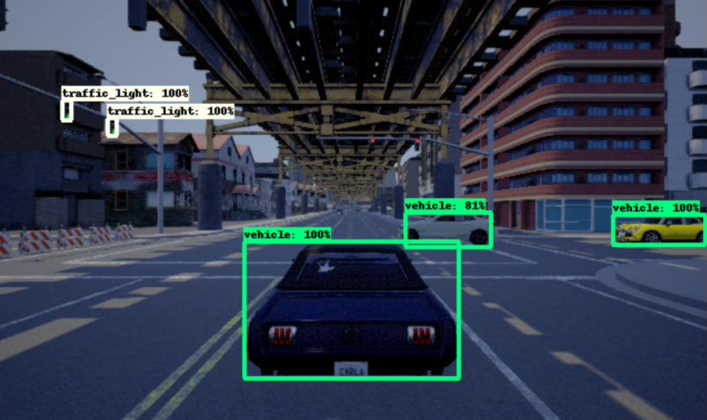
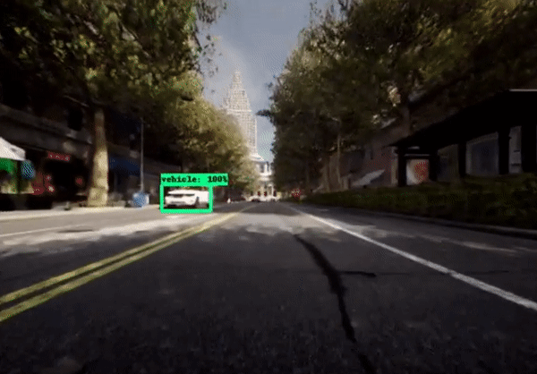
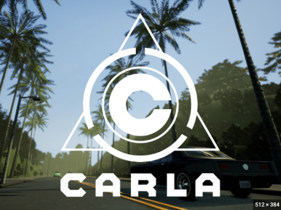
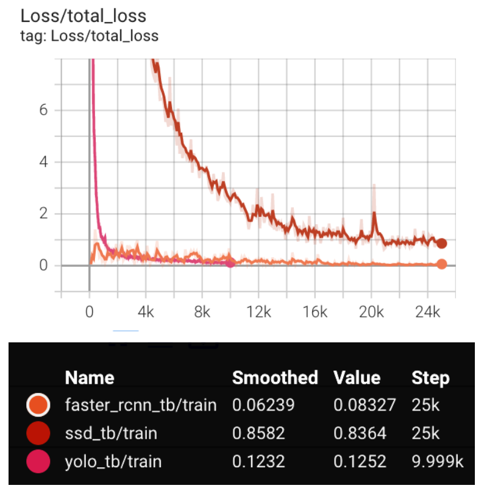
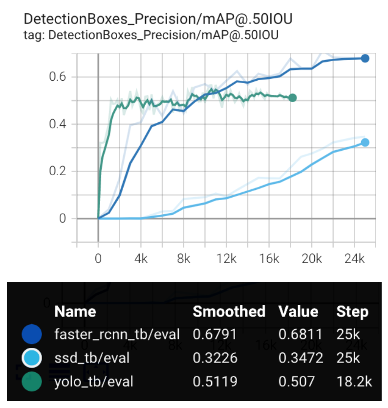
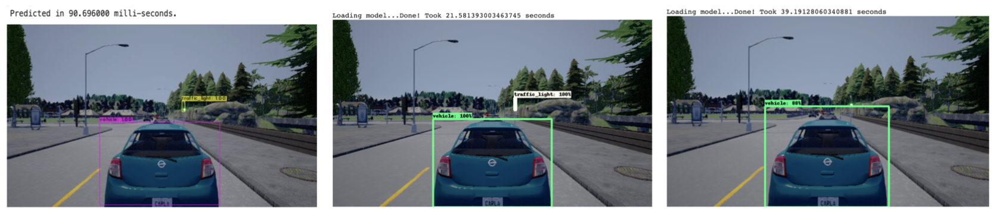

# Autonomous Vehicles: Assisted Driving with CARLA 
> CZ4042 Neural Networks & Deep Learning \
> School of Computer Science and Engineering \
> Nanyang Technological University

Vehicle detection plays an important role in civilian and military applications such as in highway traffic surveillance control, management and urban traffic planning. Accurate recognition of traffic lights and signs on roads is a critical step in deploying assisted and automated driving systems.

The importance of these systems is that they can help reduce the volume of road casualties. According to a [Stanford Law School report](http://cyberlaw.stanford.edu/blog/2013/12/human-error-cause-vehicle-crashes), at least 90% of all automobile crashes are caused fully or in part by human error. Hence, higher levels of autonomy has the potential to reduce reckless driver behaviors, aid people with disabilities and enhance the independence for senior citizens while driving.

This project explores neural networks & deep learning to train 3 different models: You Only Look Once (YOLOv3), Faster RCNN and SSD Resnet on a custom dataset, to detect the following objects - vehicles, bikes, motorbikes, traffic signs and traffic lights in CARLA, a real world driving environment simulator.

    

## CARLA
CARLA is an open-source autonomous driving simulator that supports development, training, and validation of autonomous driving systems. It allows users to control diverse specifications of the simulation including traffic generation, pedestrian behaviors, weather and sensor suites. It also offers custom map creation using available digital assets like urban layouts, buildings and vehicles. 

Some benefits of using a simulator include: 
* time and cost optimisations
* the opportunity to study the driving environment and configurations
* rigorous regulation of experimental set ups with granular record of all pertinent parameters
 
Hence, in this project CARLA is utilised to build the assisted driving models. Subsequently, the best resulting model is deployed to detect objects within the CARLA Live Feed environment. 

For further reference, look up: https://carla.org/

## Methodology
### Data Collection & Preprocessing
This project utilises a custom dataset, with the base labelled set procured [here](https://github.com/DanielHfnr/Carla-Object-Detection-Dataset). This dataset is composed of 208 test images and 820 training images. These are annotated in the PASCAL-VOC XML format with five categories of classes: vehicle, bike, motorbike, traffic lights, and traffic signs. The images were collected from the CARLA self-driving car simulation environment in a variety of traffic and weather conditions. Preprocessing steps include image resizing and data augmentation to alter the hue, saturation and exposure of images in a randomized manner. 

### Models
* YOLOv3
* Faster RCNN
* SSD ResNet

## Results 
### Training Loss
Training Loss is a measure of how well the model is fitting the training data. The graph below observes the expected trend - as the training iterations progress the loss incrementally decreases.

### Mean Average Precision (mAP)
Mean Average Precision is a measure that combines recall and precision for ranked retrieval results over all test instances. The graph below shows the mean average precision at 0.5 IoU (Intersection over Union) for all models. Also note that the precision is highest for Faster RCNN at 0.6791, slightly lower for YOLO at 0.5119 and the lowest for SSD at 0.3226

### Model Predictions

In conclusion, each model presents its own inherent advantages and limitations in terms of predictive accuracy, computational resources, speed, false positives, false negatives (especially for small objects). In in the context of assisted driving, accuracy is of highest value as inaccurate object detections can have significant impact fencing between life and death. Consequently, it is critical to maximise the Mean Average Precision (mAP) value for a model, which results in Faster RCNN in this case. 

## Future Works
This project serves as a foundation for exciting future work. The initial experimentation of the object detection models provides insight into the best performing models in both simulated and real life scenarios. Further optimizations may include images from multiple cameras on the same car, or even sensory data, such as LIDAR and RADAR. The insights derived aim to contribute to building large sophisticated navigation systems, leading to models that can adapt and work with increasing levels of driving autonomy.

## Team 
* Anusha Datta
* Amrita Ravishankar 
* Rohan Gautam
